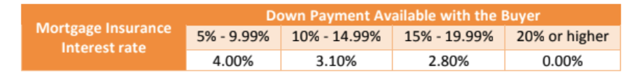
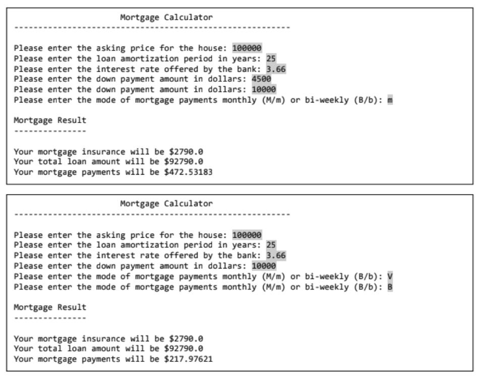

# COMP248_A2
Write a program to determine the mortgage insurance, loan amount and mortgage payments for a person buying a house. The program should ask the user for the following things:  
(1) Asking price for the house 
(2) Loan amortization period in years 
(3) Interest rate offered by the bank 
(4) Down payment available with the user 
(5) Mortgage payments monthly (M/m) or bi-weekly (B/b)  
The mortgage insurance interest rates for various down payment ranges are mentioned below along with the formulae required to compute mortgage insurance, loan amount and mortgage payments.

 
The formula to calculate the Mortgage Insurance: 
Mortgage Insurance (MI) = (Asking Price - Down Payment) × Mortgage insurance interest. 
Loan Amount = Asking Price - Down Payment + Mortgage insurancev
The mortgage payments depend on loan amount, loan amortization period, interest rate offered by the bank (not the mortgage insurance interest rate), and whether the payments are made monthly or bi-weekly. 
Mortgage payments M = L × (r(1+r)^n)/(((1+r)^n)-1) 
where, L is the loan amount, r is the monthly/bi-weekly interest rate (to be computed based on the yearly interest rate) and n is the number of payments. 
You need to force the user to enter minimum 5% down payment and correct character for mode of mortgage payments (i.e. M/m or B/b) by the use of loop construct in Java. Here are a few sample outputs to illustrate the expected behavior of your program: 

